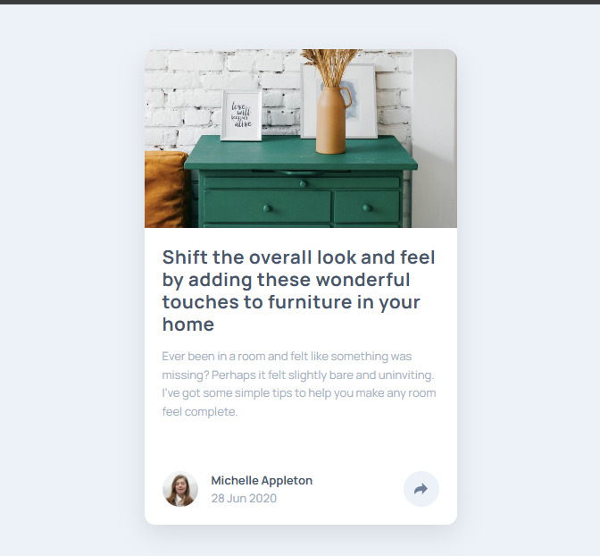
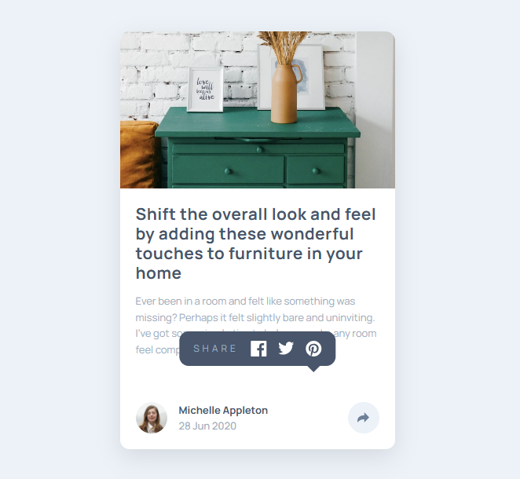
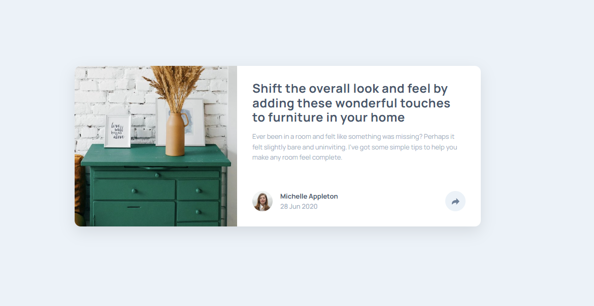

# Frontend Mentor - Article preview component solution

This is a solution to the [Article preview component challenge on Frontend Mentor](https://www.frontendmentor.io/challenges/article-preview-component-dYBN_pYFT). Frontend Mentor challenges help you improve your coding skills by building realistic projects. 

## Table of contents

- [Overview](#overview)
  - [The challenge](#the-challenge)
  - [Screenshot](#screenshot)
  - [Links](#links)
- [My process](#my-process)
  - [Built with](#built-with)
  - [What I learned](#what-i-learned)
  - [Continued development](#continued-development)
  - [Useful resources](#useful-resources)
  - [AI Collaboration](#ai-collaboration)
- [Author](#author)
- [Acknowledgments](#acknowledgments)


## Overview

### The challenge

Users should be able to:

- View the optimal layout for the component depending on their device's screen size
- See the social media share links when they click the share icon

### Screenshot





### Links

- Solution URL: [Add solution URL here](https://your-solution-url.com)
- Live Site URL: [Live site URL](https://aninweze-chinaza.github.io/article-preview-component/)

## My process

### Built with

- Semantic HTML5 markup (like `<article>` and `<main>`)
- CSS Flexbox (for centering the card and the internal layout)
- Mobile-first workflow (starting with the mobile layout and using `@media`)
- Vanilla JavaScript (for the toggle logic)

### What I learned

This project helped me understand how to build a clean UI component from scratch using HTML and CSS while focusing on layout and spacing.

One of the key things I learned was how to structure content properly using semantic HTML. Using elements like `<article>` and grouping related content (like the author section) made the layout easier to style and manage.

I also improved my understanding of Flexbox. I used it to:

- Align items horizontally in the author section
- Space elements properly using `justify-content` and `gap`
- Prepare the layout for responsive design (mobile vs desktop)

Another important lesson was spacing and visual hierarchy. I learned that:

- Consistent padding creates a cleaner design
- Typography (font size, weight, and color) affects readability
- Small spacing changes can make a big difference in how professional a UI looks

Finally, I started thinking in a mobile-first way, building the stacked layout first, then planning how it will change on larger screens.

I'm particularly proud of the logic used to close the share menu when a user clicks anywhere else on the screen:

```js
// Close popup when clicking outside of the button or the popup itself
document.addEventListener("click", (e) => {
    if (!button.contains(e.target) && !popup.contains(e.target)) {
        popup.classList.remove("active");
    }
});
```
I also refined my CSS skills by using the `filter` property to toggle icon colors and `::after` to create a custom tooltip pointer:

```css
/* Creating the tooltip triangle */
.share-popup::after {
    content: "";
    position: absolute;
    bottom: -8px;
    border-left: 8px solid transparent;
    border-right: 8px solid transparent;
    border-top: 8px solid hsl(217, 19%, 35%);
}

/* Inverting icon color on hover */
#share-button:hover img {
    filter: brightness(0) invert(1);
}
```

### Continued development

For my future projects, I want to focus on deepening my knowledge of Vanilla JavaScript. While I’ve successfully implemented event listeners and basic DOM manipulation in this project, I want to explore:

- Advanced DOM Traversal : Learning more efficient ways to navigate and manipulate the HTML structure.
- Code Architecture: Improving how I organize my script files to keep logic clean and scalable as projects grow in complexity.

### Useful resources

- [MDN](https://developer.mozilla.org) - Helped me understand Flexbox and CSS properties more clearly

- [](https://css-tricks.com/snippets/css/a-guide-to-flebox/) - A very helpful visual guide for Flexbox


### AI Collaboration

I used ChatGPT as a learning assistant during this project.

- I used it mainly for guidance, not for copying code
- It helped me understand concepts like Flexbox, spacing, and layout structure
- It guided me step-by-step instead of giving full solutions, which helped me learn better

What worked well:

- Breaking problems into small steps
- Explaining the “why” behind CSS decisions
- Helping me debug layout issues

What didn’t work well:

- At first, I wanted direct answers, but I realized learning happens more when I try things myself

Overall, it helped me think more like a frontend developer rather than just writing code.

## Author

- Website - [Aninweze Chinaza](https://www.your-site.com)
- Frontend Mentor - [@Aninweze-Chinaza](https://www.frontendmentor.io/profile/Aninweze-Chinaza)
- Twitter - [@yourusername](https://www.twitter.com/Chinaza_An)


## Acknowledgments

Thanks to the Frontend Mentor community and learning resources that helped guide me through this project. Also grateful for AI assistance that helped me understand concepts step by step instead of just providing answers.

